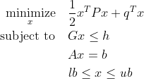

# QP Solvers for Python

[](https://pypi.org/project/qpsolvers/)
[](https://scaron.info/doc/qpsolvers/)
[](https://scaron.info/doc/qpsolvers/)

Wrapper around Quadratic Programming (QP) solvers in Python, with a unified interface.

## Installation

The simplest way to install this module is:
```sh
# Python 2
sudo apt install python-dev
pip install qpsolvers

# Python 3
sudo apt install python3-dev
pip3 install qpsolvers
```
You can add the ``--user`` parameter for a user-only installation. See also the [documentation](https://scaron.info/doc/qpsolvers/installation.html) for advanced installation instructions.

## Usage

The function ``solve_qp(P, q, G, h, A, b, lb, ub)`` is called with the ``solver`` keyword argument to select the backend solver. The convex quadratic program it solves is, in standard form:



Vector inequalities are taken coordinate by coordinate. The matrix *P* should be [positive definite](https://en.wikipedia.org/wiki/Definite_symmetric_matrix).

## Example

To solve a quadratic program, simply build the matrices that define it and call the ``solve_qp`` function:

```python
from numpy import array, dot
from qpsolvers import solve_qp

M = array([[1., 2., 0.], [-8., 3., 2.], [0., 1., 1.]])
P = dot(M.T, M)  # this is a positive definite matrix
q = dot(array([3., 2., 3.]), M).reshape((3,))
G = array([[1., 2., 1.], [2., 0., 1.], [-1., 2., -1.]])
h = array([3., 2., -2.]).reshape((3,))
A = array([1., 1., 1.])
b = array([1.])

x = solve_qp(P, q, G, h, A, b)
print("QP solution: x = {}".format(x))
```

This example outputs the solution ``[0.30769231, -0.69230769,  1.38461538]``.

## Solvers

The list of supported solvers currently includes:

- Dense solvers:
    - [CVXOPT](http://cvxopt.org/)
    - [qpOASES](https://github.com/coin-or/qpOASES)
    - [quadprog](https://pypi.python.org/pypi/quadprog/)
- Sparse solvers:
    - [ECOS](https://web.stanford.edu/~boyd/papers/ecos.html)
    - [Gurobi](https://www.gurobi.com/)
    - [MOSEK](https://mosek.com/)
    - [OSQP](https://github.com/oxfordcontrol/osqp)

## Frequently Asked Questions

- Can I print the list of solvers available on my machine?
  - Absolutely: ``print(qpsolvers.available_solvers)``
- Is it possible to solve a least squares rather than a quadratic program?
  - Yes, `qpsolvers` also provides a [solve\_ls](https://scaron.info/doc/qpsolvers/getting-started.html#qpsolvers.solve_ls) function.
- I have a squared norm in my cost function, how can I apply a QP solver to my problem?
  - You can [cast squared norms to QP matrices](https://scaron.info/teaching/conversion-from-least-squares-to-quadratic-programming.html) and feed the result to `solve_qp`.
- I have a non-convex quadratic program. Is there a solver I can use?
  - Unfortunately most available QP solvers are designed for convex problems. 
  - If your cost matrix *P* is semi-definite rather than definite, try OSQP. 
  - If your problem has concave components, go for a nonlinear solver such as [IPOPT](https://pypi.org/project/ipopt/) *e.g.* using [CasADi](https://web.casadi.org/).
- I get the following [build error on Windows](https://github.com/stephane-caron/qpsolvers/issues/28) when running `pip install qpsolvers`.
  - You will need to install the [Visual C++ Build Tools](https://visualstudio.microsoft.com/visual-cpp-build-tools/) to build all package dependencies.

## Performances

On a [dense problem](examples/dense_problem.py), the performance of all solvers (as measured by IPython's ``%timeit`` on my machine) is:

| Solver   | Type   | Time (ms) |
| -------- | ------ | --------- |
| quadprog | Dense  | 0.02      |
| qpoases  | Dense  | 0.03      |
| osqp     | Sparse | 0.04      |
| ecos     | Sparse | 0.34      |
| cvxopt   | Dense  | 0.46      |
| gurobi   | Sparse | 0.84      |
| cvxpy    | Sparse | 3.40      |
| mosek    | Sparse | 7.17      |

On a [sparse problem](examples/sparse_problem.py), these performances become:

| Solver   | Type   | Time (ms) |
| -------- | ------ | --------- |
| osqp     | Sparse |    1      |
| mosek    | Sparse |   17      |
| ecos     | Sparse |   21      |
| cvxopt   | Dense  |  186      |
| gurobi   | Sparse |  221      |
| quadprog | Dense  |  550      |
| cvxpy    | Sparse |  654      |
| qpoases  | Dense  | 2250      |

Finally, here are the results on a benchmark of [random problems](examples/random_problems.py) (each data point corresponds to an average over 10 runs):


Note that performances of QP solvers largely depend on the problem solved. For instance, MOSEK performs an [automatic conversion to Second-Order Cone Programming (SOCP)](https://docs.mosek.com/8.1/pythonapi/prob-def-quadratic.html) which the documentation advises bypassing for better performance. Similarly, ECOS reformulates [from QP to SOCP](qpsolvers/ecos_.py) and [works best on small problems](https://web.stanford.edu/%7Eboyd/papers/ecos.html).
